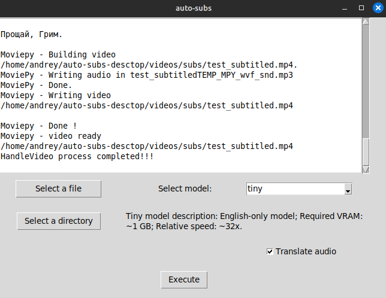

# program automatic makes subtitles for video in many languages

First you need to install imagemagick, ffmpeg. 
After installing requirements you need to to choose file.mp4 which you want to translate and directory where you want to save your new video with subtitles. After that program start work

