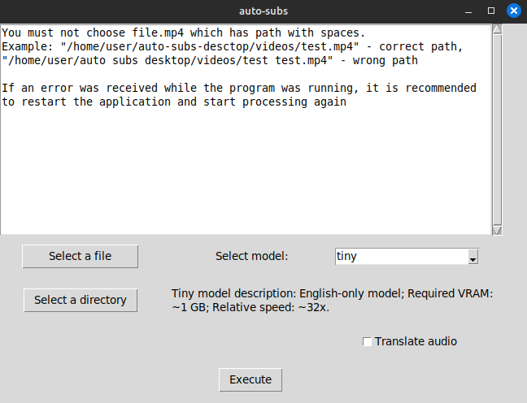

# program automatic makes subtitles for video in many languages

First you need to install imagemagick, ffmpeg, python 3.11 for Windows, python 3.10 for linux. If you get some errors related to ffmpeg you'll need to fix them yourself.

Before install requirements it is better to make python virtualenv.

for windows
```
py -3.11 -m venv venv;
./venv/scripts/activate;
pip install -r requirements_for_windows.txt;
```

for linux

install virtual environment
```
python3 -m venv venv;
```

or
```
python3.10 -m venv venv;
```
activate virtual environment
```
. ./venv/bin/activate;
```

install requirements for linux for execution with amdgpu
```
pip3 install -r requirements_gpu.txt;
```

install requirements for linux for execution with cpu
```
pip3 install -r requirements_cpu.txt;
```

After installing requirements you need to to choose file.mp4 which you want to translate and directory where you want to save your new video with subtitles. Then choose size of model for recognize audio which you want. Also you can choose "Translate audio" if you want to get video with new translated audio. After that you need to press button 'execute'. Then the program should start work.



